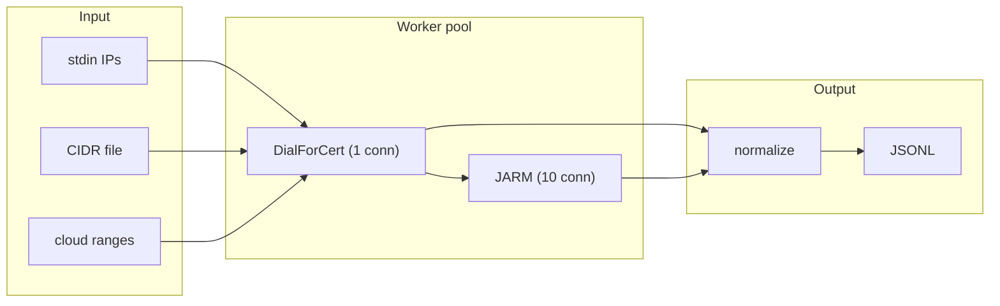

# rxds // rx/dialstreamer

High-speed TLS certificate harvesting from SSLv2 through TLS 1.3.
Application-layer complement to zmap/masscan.

[](https://github.com/x-stp/rxds/actions/workflows/ci.yml)
[](https://opensource.org/licenses/MPL-2.0)

## what it does

`rxds` dials TCP endpoints, performs a TLS handshake just far enough to receive the server's certificate chain, then stops. It never completes the handshake. Supports SSLv2-framed ClientHello through TLS 1.3 in a single probe, with optional JARM server fingerprinting.

Outputs normalized JSONL with CN, SANs, root domains, fuzzy hash, SHA-256 fingerprint, and JARM hash. Feed it open hosts from zmap/masscan, get certs out.



## install

```bash
go install github.com/x-stp/rxds/cmd/rxds@latest
```

Or build from source:

```bash
make build
```

Repo-local Git hooks live in `.githooks/`; point Git at them with `git config core.hooksPath .githooks` (also set by `scripts/init-repo.sh`).

## usage

Scan IPs from stdin, write JSONL:

```bash
printf "1.1.1.1\n8.8.8.8:443\n" | rxds -out results.jsonl -concurrency 256 -timeout 5s
```

Expand CIDRs from a file:

```bash
rxds -cidrs ranges.txt -port 443 -cidr-seed 42 -out results.jsonl
```

Scan with JARM fingerprinting:

```bash
printf "1.1.1.1\n" | rxds -jarm -sni cloudflare.com -timeout 5s
```

Sample from Cloudflare IPv4 ranges:

```bash
rxds -cloud-sample 1000 -cloud-weight 16 -timeout 2s -concurrency 512 -out cf.jsonl
```

Scan all public IPv4:

```bash
rxds -global -port 443 -concurrency 65536 -timeout 3s -out sweep.jsonl
```

## example output

```json
{
  "ip": "1.1.1.1",
  "port": 443,
  "sni": "cloudflare.com",
  "cn": "cloudflare.com",
  "sans": ["ns.cloudflare.com", "secondary.cloudflare.com"],
  "org": "",
  "apex_domain": "cloudflare.com",
  "root_domains": ["cloudflare.com"],
  "fuzzy_hash": "345b2ff160e7d973121da53a6771a390717928b90e64daa39b087c580f4b3e77",
  "sha256": "da9fca34e821865e3066db0f029492013b6517f14aaf5a693abde9a48a174c19",
  "jarm": "27d40d00000040d1dc42d43d00041de892a844a7a3efc0739d1779714fa0b1"
}
```

One JSON object per line (JSONL). The `jarm` field appears only when `-jarm` is set.

## flags

| flag | default | description |
|------|---------|-------------|
| `-out` | stdout | output JSONL file |
| `-cidrs` | | file with CIDRs/IPs to expand |
| `-concurrency` | 256 | concurrent dials |
| `-timeout` | 5s | per-target timeout |
| `-sni` | | SNI to send |
| `-port` | 443 | default port for bare IPs |
| `-jarm` | false | compute JARM TLS fingerprint (10 extra connections per host) |
| `-sslv2hello` | false | SSLv2-framed ClientHello for legacy compat |
| `-cidr-seed` | 1 | seed for CIDR permutation order |
| `-print-errors` | false | emit JSONL for dial/handshake errors |
| `-print-empty` | false | emit JSONL even if cert has no CN/SANs |
| `-cloud-sample` | 0 | sample N targets from cloud ranges |
| `-cloud-weight` | 8 | cloud vs non-cloud scheduling weight |
| `-global` | false | scan all public IPv4 |

## how it works

rxds is not a SYN scanner. It sits in the zgrab2/tlsx slot: the application-layer scanner that runs after host discovery.

| technique | what it does |
|-----------|-------------|
| CertsOnly early exit | stops after receiving the certificate chain; never sends Finished |
| template ClientHello | builds the ClientHello once per Config, patches only random/sessionID/keyShare per dial |
| JARM fingerprinting | 10 raw TCP probes per target, 1484 bytes each, hashed into a 62-char server fingerprint |
| SSLv2 framing | harvests certs from legacy endpoints that reject modern ClientHello |
| Feistel permutation | pseudorandom CIDR scan order to avoid sequential bias and IDS detection |
| CPU preheat | warms AES-GCM hardware units before the first handshake |
| graceful shutdown | SIGINT/SIGTERM flushes buffered output before exit |

## performance

Benchmarked on AMD Ryzen 7 7840U, `net.Pipe` loopback (no network latency):

| protocol | allocs/op | B/op | ns/op |
|----------|-----------|------|-------|
| TLS 1.2 | 238 | 24,050 | 740K |
| TLS 1.3 | 637 | 57,333 | 1,140K |

The template ClientHello eliminates 35 allocations per dial compared to rebuilding the ClientHello from scratch. The remaining allocations are dominated by `x509.ParseCertificate` on the server response.

## project layout

```
rxds/
  cmd/rxds/         CLI entry point
  tls/              forked crypto/tls with CertsOnly, SSLv2, template ClientHello
  jarm/             JARM probe builder, ServerHello parser, hash computation
  normalize/        certificate normalization (CN, SANs, root domains, fuzzy hash)
  cryptobyte/       TLS byte parsing/building (forked from x/crypto)
  curve25519/       X25519 ECDH via crypto/ecdh
  hkdf/             HKDF extract/expand (RFC 5869)
  internal/cpu/     CPU feature detection for AES-NI/AVX
  tests/            integration, benchmark, leak, SSLv2 fake server tests
  scripts/          init-repo.sh
```

## funding

If this tool is useful to you:

- [ko-fi.com/securetheplanet](https://ko-fi.com/securetheplanet)
- [buymeacoffee.com/xstp](https://buymeacoffee.com/xstp)
- [github.com/sponsors/xstp](https://github.com/sponsors/xstp)

## license

[MPL-2.0](LICENSE)
