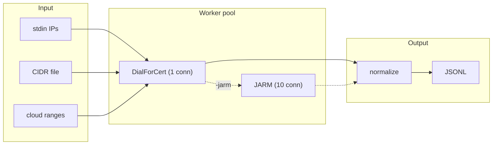
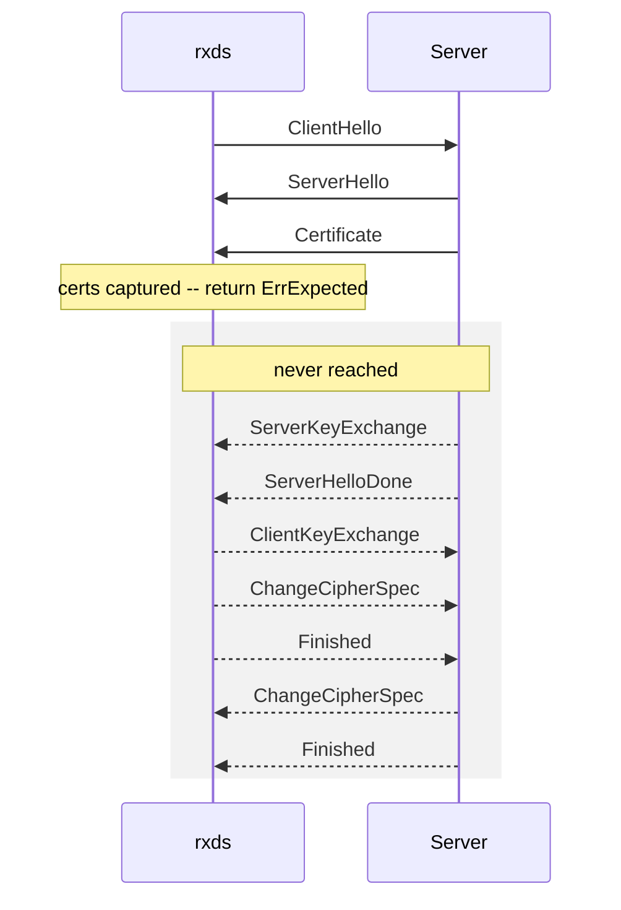
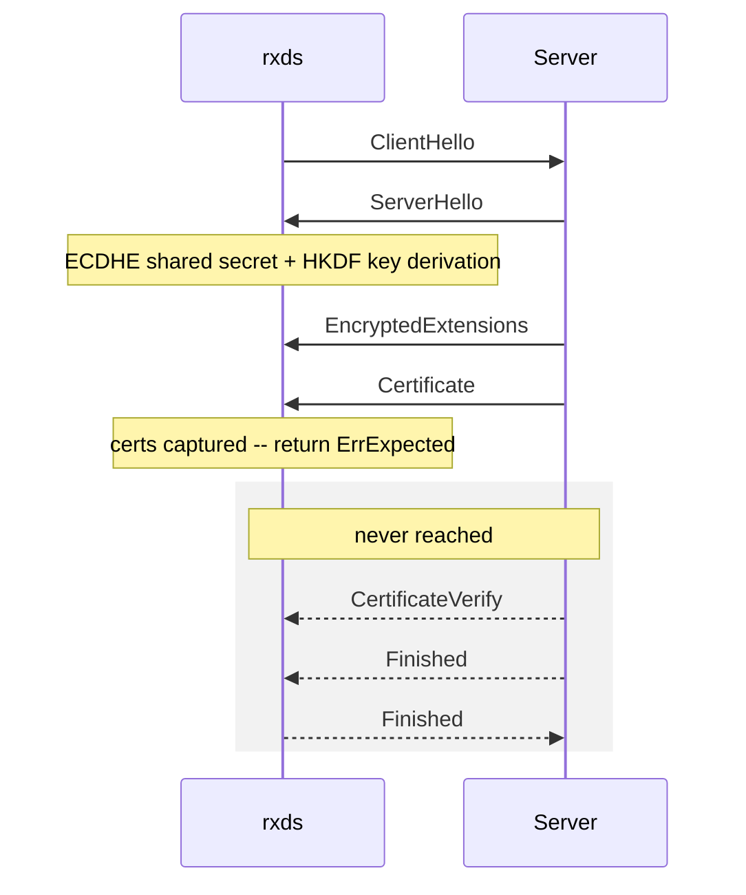
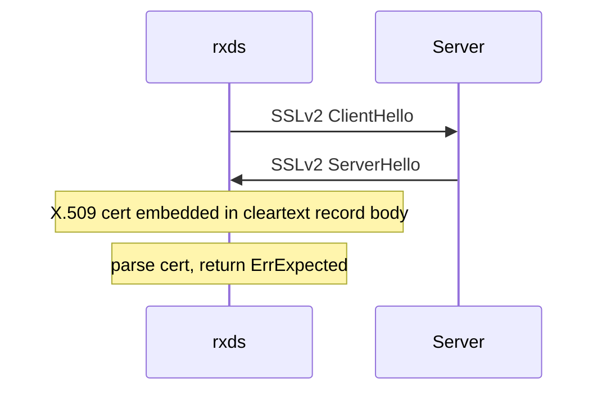
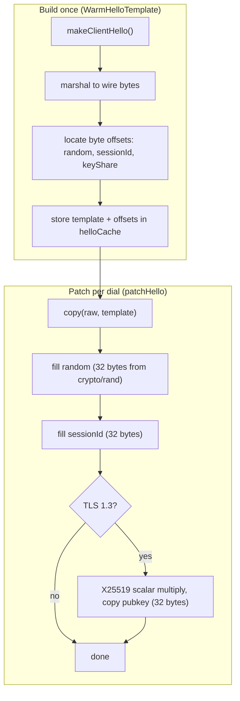
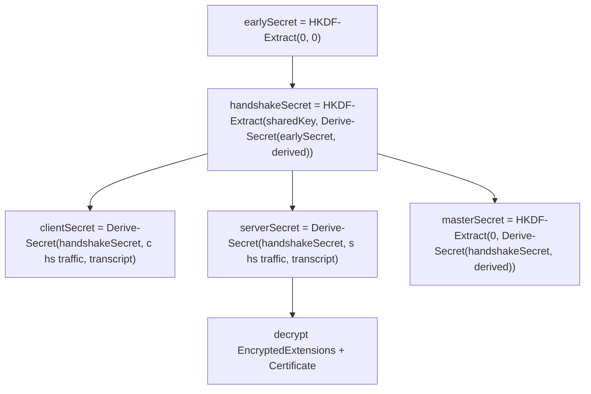
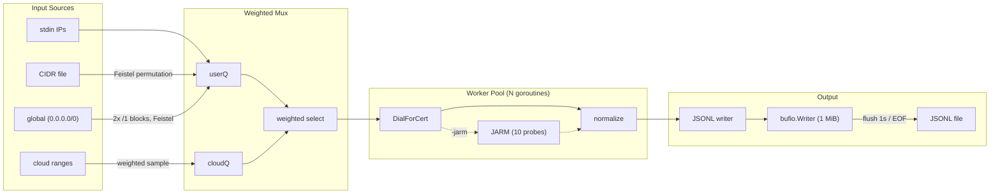
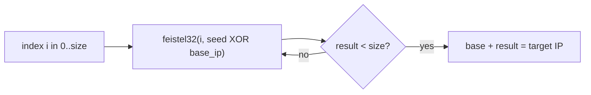
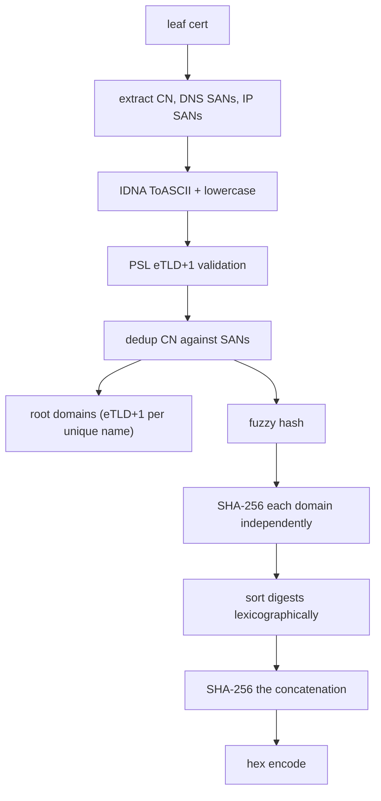

# rxds // rx/dialstreamer

The fastest TLS certificate scanner. SSLv2 through TLS 1.3, JARM fingerprinting, 238 allocs per dial.

[](https://github.com/x-stp/rxds/actions/workflows/ci.yml)
[](https://opensource.org/licenses/MPL-2.0)

## what it does

`rxds` dials TCP endpoints, performs a TLS handshake just far enough to receive the server's certificate chain, then stops. It never completes the handshake. Supports SSLv2-framed ClientHello through TLS 1.3 in a single probe, with optional JARM server fingerprinting.

Outputs normalized JSONL with CN, SANs, root domains, fuzzy hash, SHA-256 fingerprint, and JARM hash.



## install

```bash
go install github.com/x-stp/rxds/cmd/rxds@latest
```

Or build from source:

```bash
make build
```

Repo-local Git hooks live in `.githooks/`; point Git at them with `git config core.hooksPath .githooks` (also set by `scripts/init-repo.sh`).

## usage

Scan all public IPv4 (default behavior):

```bash
rxds -out planet.jsonl -concurrency 80000 -timeout 300ms
```

Scan specific CIDRs with a denylist:

```bash
rxds -cidrs ranges.txt -denylist skip.txt -no-global -out results.jsonl
```

Scan IPs from stdin:

```bash
printf "1.1.1.1\n8.8.8.8:443\n" | rxds -no-global -out results.jsonl
```

Scan with JARM fingerprinting:

```bash
printf "1.1.1.1\n" | rxds -no-global -jarm -sni cloudflare.com -timeout 5s
```

Sample from Cloudflare IPv4 ranges:

```bash
rxds -cloud-sample 100000 -cloud-weight 16 -timeout 2s -concurrency 512 -no-global -out cf.jsonl
```

## example output

```json
{
  "ip": "1.1.1.1",
  "port": 443,
  "sni": "cloudflare.com",
  "cn": "cloudflare.com",
  "sans": ["ns.cloudflare.com", "secondary.cloudflare.com"],
  "org": "",
  "apex_domain": "cloudflare.com",
  "root_domains": ["cloudflare.com"],
  "fuzzy_hash": "345b2ff160e7d973121da53a6771a390717928b90e64daa39b087c580f4b3e77",
  "sha256": "da9fca34e821865e3066db0f029492013b6517f14aaf5a693abde9a48a174c19",
  "jarm": "27d40d00000040d1dc42d43d00041de892a844a7a3efc0739d1779714fa0b1"
}
```

One JSON object per line (JSONL). The `jarm` field appears only when `-jarm` is set.

## flags

| flag | default | description |
|------|---------|-------------|
| `-out` | stdout | output JSONL file |
| `-cidrs` | | file with CIDRs/IPs to scan |
| `-denylist` | | file with CIDRs/IPs to skip |
| `-no-global` | false | disable default global scan (read stdin instead) |
| `-concurrency` | 256 | concurrent dials |
| `-timeout` | 5s | per-target timeout |
| `-sni` | | SNI to send |
| `-port` | 443 | default port |
| `-jarm` | false | JARM fingerprint (10 extra connections per host) |
| `-sslv2hello` | false | SSLv2-framed ClientHello |
| `-print-errors` | false | emit JSONL for errors |
| `-print-empty` | false | emit JSONL even if no CN/SANs |
| `-cloud-sample` | 0 | sample N targets from cloud ranges |
| `-cloud-weight` | 8 | cloud scheduling weight |

By default, rxds scans all public IPv4 (`0.0.0.0/0`) in pseudorandom order. Use `-no-global` to switch to stdin or `-cidrs` mode. The permutation seed is randomized per run via `crypto/rand`.

## how it works

rxds connects, grabs certs, and gets out. Every part of the pipeline is optimized to minimize allocations and round-trips.

| technique | what it does |
|-----------|-------------|
| CertsOnly early exit | stops after receiving the certificate chain; never sends Finished |
| template ClientHello | builds the ClientHello once per Config, patches only random/sessionID/keyShare per dial |
| JARM fingerprinting | 10 raw TCP probes per target, 1484 bytes each, hashed into a 62-char server fingerprint |
| SSLv2 framing | harvests certs from legacy endpoints that reject modern ClientHello |
| Feistel permutation | pseudorandom CIDR scan order to avoid sequential bias and IDS detection |
| CPU preheat | warms AES-GCM hardware units before the first handshake |
| weighted mux | probabilistic scheduling between cloud and user input queues |
| buffered output | 1 MiB `bufio.Writer` coalesces JSONL writes, flushes every second or on EOF |
| global /0 split | two /1 blocks avoid uint32 overflow in the Feistel permutation |
| graceful shutdown | SIGINT/SIGTERM drains workers, flushes buffered output before exit |

---

## how TLS works (and how rxds breaks the rules)

A normal TLS client completes the full handshake: key exchange, authentication, and a `Finished` round-trip before the connection is usable. rxds only needs the server's certificate chain, so it stops the moment that chain arrives. The protocol version determines how early that happens.

### TLS 1.2 early exit

In TLS 1.2 the server sends its certificate **in cleartext** before any key exchange. rxds reads the `Certificate` message and returns immediately. No cryptographic operations are performed at all.



### TLS 1.3 early exit

TLS 1.3 encrypts everything after `ServerHello`. To read the `Certificate` message rxds **must** derive handshake traffic keys via an ECDHE key exchange and HKDF. This is the minimum cryptographic work required.



### How it works in the code

`Config.CertsOnly` is always `true` -- `tls.Client()` enforces it. After parsing the server's certificate chain, `verifyServerCertificate` returns `ErrExpected`, a sentinel that `DialForCert` treats as success. The connection is closed without ever sending `ClientKeyExchange` (TLS 1.2) or `Finished` (TLS 1.3).

---

## SSLv2 certificate harvest

Some legacy servers only respond to SSLv2-framed ClientHellos. The `-sslv2hello` flag enables this path.



The SSLv2 `ServerHello` contains the server certificate in the clear (RFC 6101 Appendix E.2.2). When the first byte of the server response has the `0x80` high bit set, the record layer detects the SSLv2 framing, extracts the X.509 certificate, populates `PeerCertificates`, and returns `ErrExpected`. No TLS record layer is involved.

---

## template ClientHello

Building a `ClientHello` from scratch allocates ~35 objects (extensions, cipher suites, supported versions, signature algorithms, key shares). rxds builds it **once** per `Config` and patches only the per-connection fields for each dial.



The template is built once per `Config` and inherited by all `Clone()` copies. Per-dial cost: one `make` + `copy` for the wire buffer, 64-96 bytes of `crypto/rand`, and an optional X25519 scalar multiply for TLS 1.3 key shares. Extensions, cipher suites, and signature algorithms are frozen in the template.

---

## TLS 1.3 key derivation

TLS 1.3 encrypts the `Certificate` message, so rxds must derive handshake traffic keys before it can read the cert. This is the minimum HKDF chain required:



ECDHE uses X25519 by default (32-byte scalar in `internal/curve25519/`). HKDF uses SHA-256 or SHA-384 depending on the negotiated cipher suite (`internal/hkdf/`). The key schedule runs in `establishHandshakeKeys`, after which `readServerParameters` decrypts `EncryptedExtensions` and `readServerCertificate` reads the `Certificate` and returns `ErrExpected`.

---

## scan pipeline



Input sources feed two internal queues. A weighted mux goroutine probabilistically prefers `cloudQ` with probability `cloudWeight / (cloudWeight + 1)`, falling back to `userQ`. Worker goroutines pull targets from the mux, call `DialForCert`, optionally run JARM, normalize the certificate, and push JSONL to a buffered writer that flushes every second.

---

## Feistel permutation

CIDR ranges are scanned in pseudorandom order to avoid sequential bias and IDS detection. Each CIDR is expanded through a 4-round Feistel network with cycle-walking.



The Feistel key is `seed XOR base_ip`, so different CIDRs get different permutations from the same seed. Cycle-walking clamps the 32-bit output to the CIDR size. The `/0` global scan splits into two `/1` blocks to avoid uint32 overflow in the permutation.

---

## certificate normalization

Every leaf certificate goes through a normalization pipeline before output:



The fuzzy hash is **order-independent**: individual domain digests are sorted before the final hash, so `{a.com, b.com}` produces the same hash as `{b.com, a.com}`. PSL validation via `publicsuffix.EffectiveTLDPlusOne` drops bare TLDs, `.onion`, and `localhost`. IDNA non-transitional mapping handles internationalized domain names. Wildcard prefixes (`*.`) are stripped before normalization.

---

## performance

Benchmarked over `net.Pipe` loopback (no network latency), x86-64 with AES-NI:

| protocol | allocs/op | B/op | ns/op |
|----------|-----------|------|-------|
| TLS 1.2 | 238 | 24,050 | 740K |
| TLS 1.3 | 637 | 57,333 | 1,140K |

The template ClientHello eliminates 35 allocations per dial compared to rebuilding the ClientHello from scratch. The remaining allocations are dominated by `x509.ParseCertificate` on the server response.

## project layout

```
rxds/
  cmd/rxds/           CLI entry point
  dial.go             DialForCert -- the public scan API
  dialer_linux.go     Linux scan dialer tuning (SO_LINGER=0, TCP_FASTOPEN, buffers)
  dialer_other.go     Default scan dialer for non-Linux platforms
  preheat.go          PreHeatCPU -- warms AES-GCM / ChaCha20 hardware
  tls/                forked crypto/tls: CertsOnly, SSLv2, template ClientHello
  jarm/               JARM probe builder, ServerHello parser, hash computation
  normalize/          certificate normalization (CN, SANs, root domains, fuzzy hash)
  scan/syn/           Linux raw SYN pre-filter for IPv4 host discovery
  internal/
    cpu/              CPU feature detection (AES-NI, AVX)
    cryptobyte/       TLS byte parsing/building (forked from x/crypto)
    curve25519/       X25519 ECDH
    hkdf/             HKDF extract/expand (RFC 5869)
  tests/              integration, benchmark, leak, SSLv2 fake server tests
  scripts/            init-repo.sh, push-release.sh
```

Crypto primitives under `internal/` are implementation details of `tls/` and are not part of the public API.

## funding

If this tool is useful to you:

- [ko-fi.com/securetheplanet](https://ko-fi.com/securetheplanet)
- [buymeacoffee.com/xstp](https://buymeacoffee.com/xstp)
- [github.com/sponsors/xstp](https://github.com/sponsors/xstp)

## license

[MPL-2.0](LICENSE)
